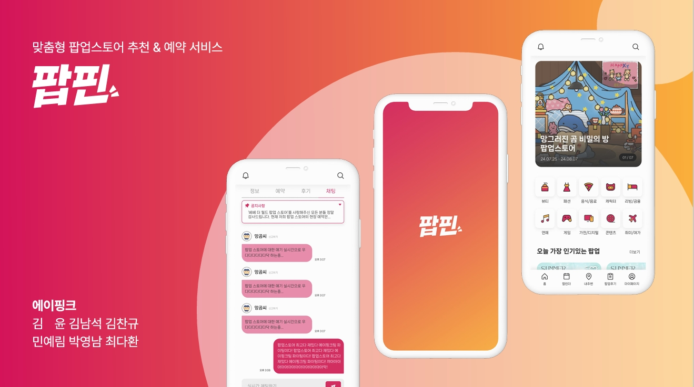
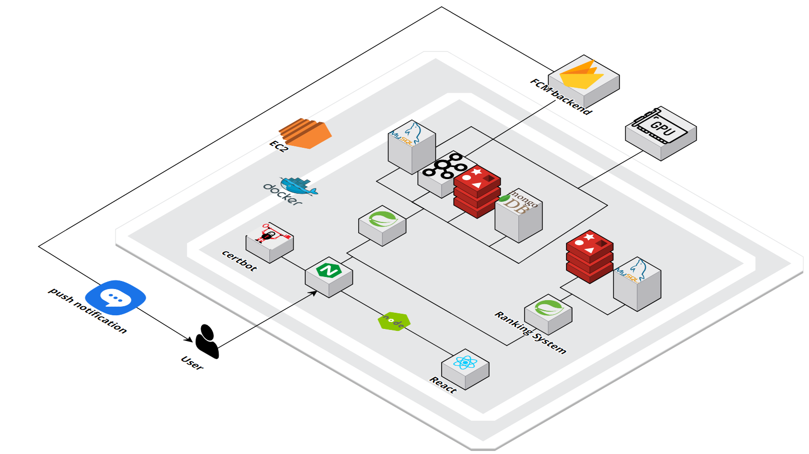
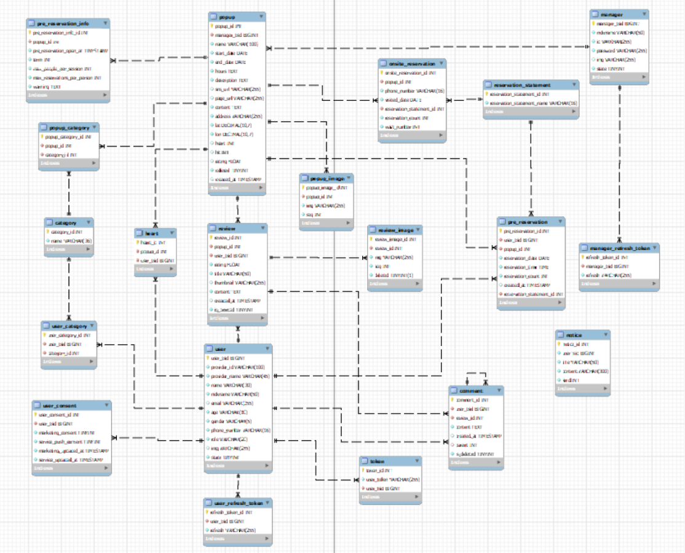

# 📌 팝핀

  

## ✨ 주제
- 팝업스토어 정보를 조회하는 순간부터 방문하는 순간까지, 팝업스토어의 모든 것을 한 번에 볼 수 있는 커뮤니티 플랫폼

## 📅 기간
- 2024.07.02 ~ 2024.08.16

## 📜 프로젝트 컨셉 및 주요 기능
### 1️⃣ 목적
- 팝업스토어 관련 정보 수집 및 에약 과정에서 발생하는 불편함 해소

### 2️⃣ 페르소나
- 나에게 딱 맞는 팝업스토어 정보를 빠르게 얻고 싶은 사람
- 팝업스토어 현장 상황을 실시간으로 알고 싶은 사람
- 팝업스토어 정보 조회부터 예약까지 한 사이트에서 해결하고 싶은 사람

### 3️⃣ 주요 기능
- 개인 맞춤형 팝업스토어 추천
- 조회수, 좋아요, 별점, 예약 건수 등 다양한 조건 기반 팝업스토어 랭킹 산정
- 채팅을 통한 팝업스토어 운영 매니저 및 관심있는 사람들과 실시간 소통
- 팝업스토어 온라인 사전 예약 및 현장 예약

### 4️⃣ 기대 효과
**팝업스토어 이용자**
- 자신의 취향에 맞는 팝업스토어를 찾는 과정이 간소화된다.
- 여러 사이트를 이용할 필요 없이 한 사이트에서 정보 조회부터 예약까지 해결할 수 있다.
- 팝업스토어의 실시간 운영 상황을 빠르게 공유할 수 있다.

**팝업스토어 운영 매니저**
- 팝업스토어 운영 및 예약 관리가 용이하다.
- 팝업스토어 홍보에서 발생하는 마케팅 비용을 절약할 수 있다.

## 💻 개발 환경 및 문서
### 1️⃣ 활용 기술

  
  
  
  

  
  
  
  
  

  
  
  
  
  

  
  
  
  

  
  
  
  
  

  
  

### 2️⃣ Architecture

  

### 3️⃣ ERD

  

## 🎨 화면 구성
### 1️⃣ User (팝업스토어 이용자)
#### 메인 화면

#### 팝업스토어 달력 & 지도

#### 팝업스토어 상세

#### 팝업스토어 사전 예약 등록

#### 팝업스토어 현장 예약 대기

#### 팝업스토어 후기 작성 및 조회

### 2️⃣ Manager (팝업스토어 운영 매니저)
#### 매니저 로그인

#### 팝업스토어 등록

#### 팝업스토어 현장 예약 등록

## 👥 참여 인원 및 역할
### 💗TEAM APINK💗
|김윤|김남석|김찬규|민예림|박영남|최다환|
|:---:|:---:|:---:|:---:|:---:|:---:|
|||||||
|**FE, Leader**|**BE**|**Infra**|**BE**|**FE**|**BE**|
